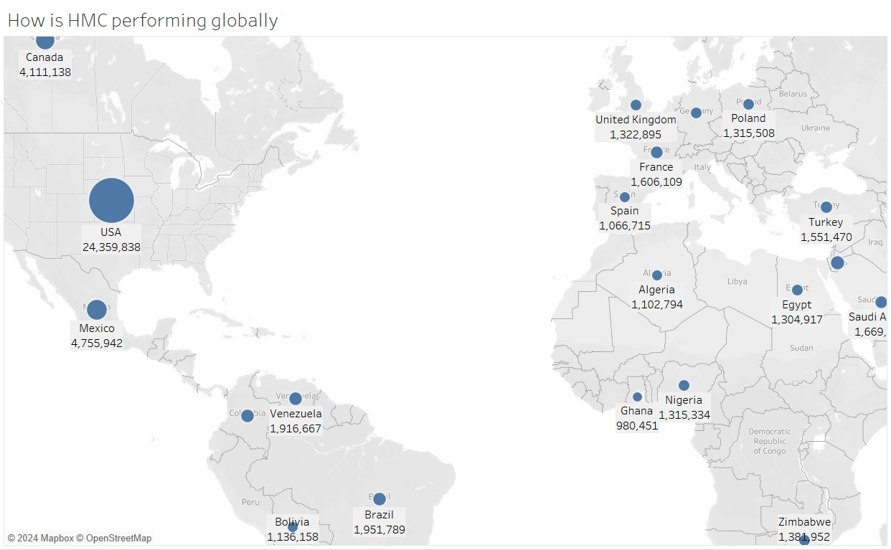

# Profitability-Performance-Analysis-for-Huskie-Motor-Corporation

OVERVIEW - This project delivers a full-scale financial and operational analysis of Huskie Motor Corporation (HMC) using cleaned datasets and interactive Tableau dashboards. The goal is to equip HMC executives with actionable, data-driven insights for decision-making across profitability, sales strategy, and production planning.

Objectives - 
Evaluate global and brand-level performance.
Analyze financial metrics: contribution margins, variable costs, and cost variability.
Assess operational efficiency: top-selling options, inventory turnover.
Forecast sales volume and contribution margins for the next 4 quarters.

Tools Used -
Excel –> Data cleaning and structuring,
Tableau –> Dashboard development and forecasting,
PowerPoint –> Executive presentation of findings.

Key Findings - 
Global & Brand Performance,
USA is HMC’s top-performing region (24M+ units),
Apechete and Tatra lead in brand-level gross sales,
Special brand is underperforming.

Financial Analytics - 
Advantage model shows the highest contribution margin (~4M).
-Jespie and Mortimer models have negative or very low margins.
-Chare exhibits the highest cost variability, signaling risk.

Operational Analytics-
Most sold option: Power Mirror (1,295 units),
-**Longest time on lot**: Island model (~147 days).
-**Shortest**: Summet and Mortimer (~95 days).

Forecasting Insights
Sales expected to stabilize, then sharply drop in Q4 2017.
-Contribution margin follows a similar declining trend.

